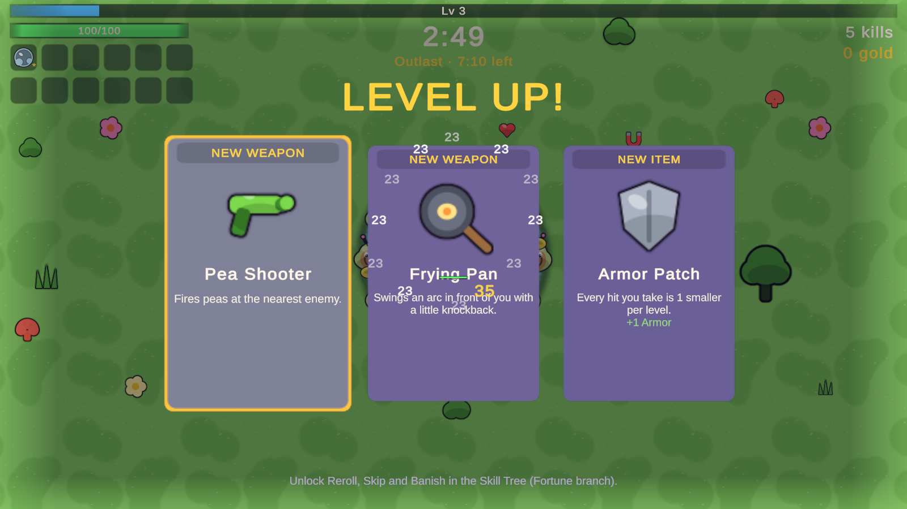
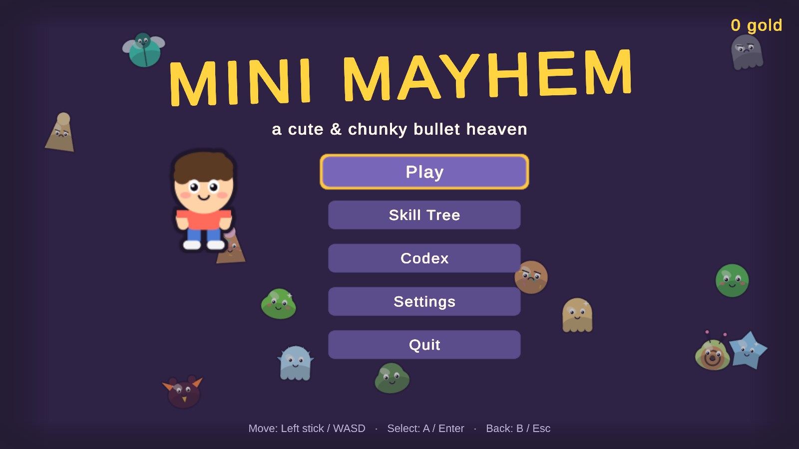
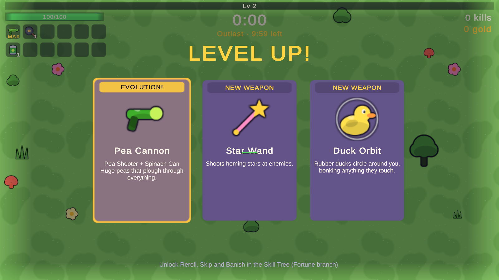
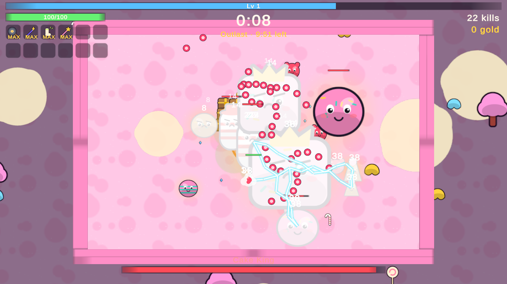
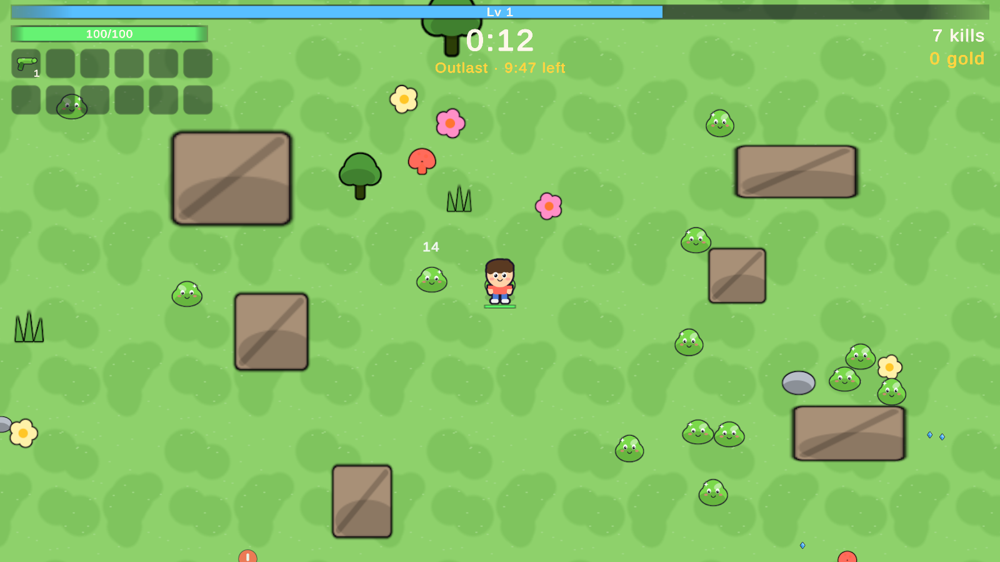
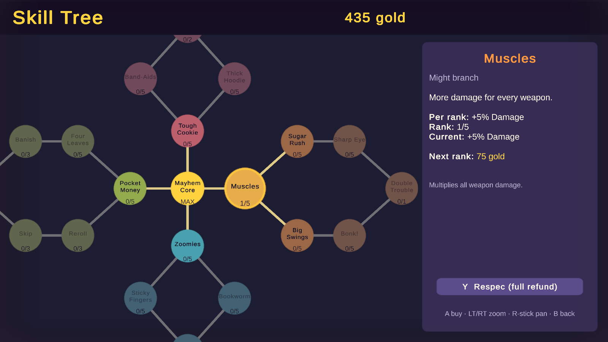
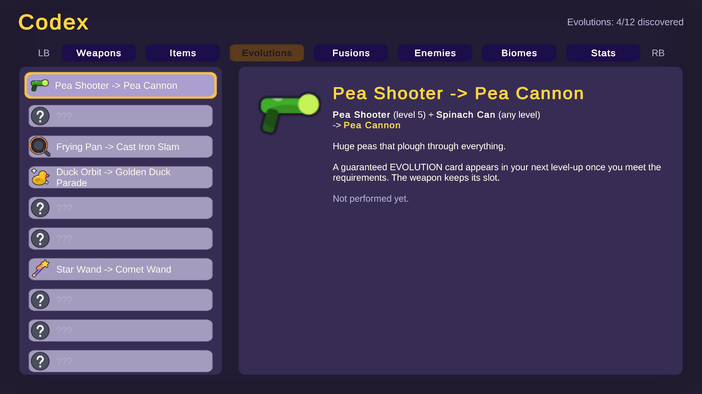
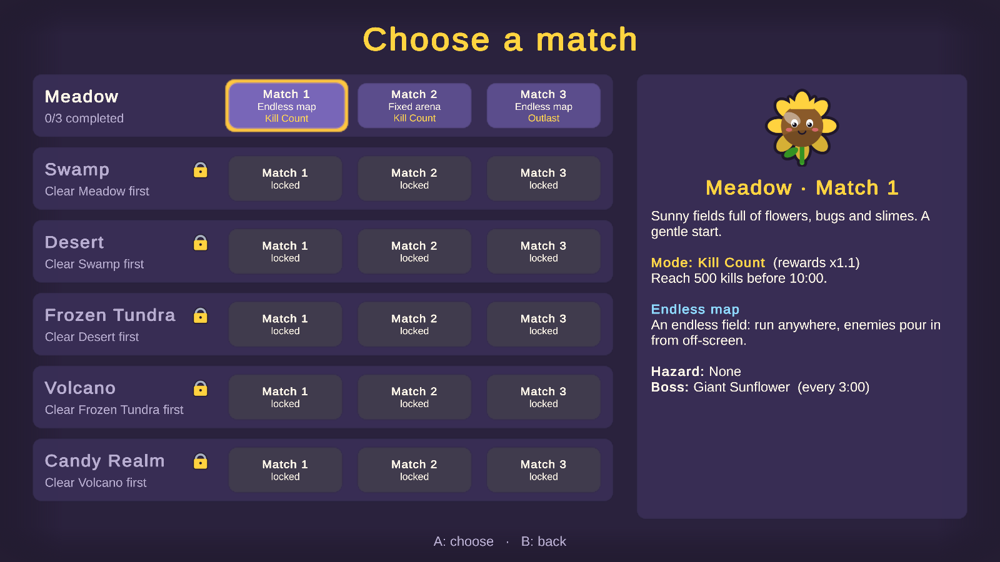
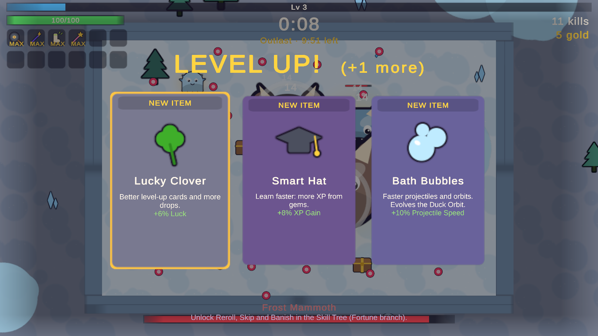

# Mini Mayhem

A cute and chunky 2D top-down survivor-like (bullet heaven). You only move; your weapons fire on their own.
Enemies arrive in waves that swell into screen-filling chaos. Collect XP gems, level up, pick weapons and items,
evolve and fuse them, beat the boss every three minutes, then spend your gold on a permanent skill tree.

Unity **6000.3.25f1**, URP, new Input System, TextMeshPro. All art and audio are procedural: sprites are drawn in
code into a shared atlas, sound effects and music are synthesised. There are no imported assets.
Design doc: [Docs/GAME_PLAN.md](Docs/GAME_PLAN.md).



| | |
|---|---|
|  |  |
|  |  |
|  |  |
|  |  |

## Getting started

1. Open the project folder in Unity 6000.3.25f1. The scene `Assets/_Project/Scenes/MiniMayhem.unity` opens
   automatically (or use **Mini Mayhem > Open Game Scene**).
2. Plug in an Xbox controller (keyboard and mouse work too) and press Play.
3. **Play** -> pick a match -> pick your starting weapon.

A Windows build: **Mini Mayhem > Build Windows Player** (or `./Tools/unity.ps1 player`) writes `Builds/Windows/MiniMayhem.exe`.

## Controls

| Action | Xbox controller | Keyboard / mouse |
|---|---|---|
| Move | Left stick / D-pad | WASD / arrows |
| Menus: move / select / back | Stick or D-pad / A / B | Arrows / Enter or Space / Esc |
| Level-up: pick / reroll / banish / skip | A / Y / X / B | Enter / R / X / Backspace |
| Pause | Start | Esc |
| Codex tabs | LB / RB | Q / E |
| Skill tree: buy / respec / zoom / pan | A / Y / LT RT / right stick | Enter / R / mouse wheel |
| FPS and entity counter | View | F3 |

The mouse works on every menu (hover focuses, click selects). The focused button always has a gold frame.

## The game

- **Runs** last 10 minutes. Weapons auto-target; XP gems are pulled in inside your pickup radius. Each level-up
  pauses the game and offers 3 cards (4 with the skill tree): a new weapon, a new item or an upgrade.
- **12 weapons** across 10 archetypes (projectile, boomerang, melee arc, orbit, chain lightning, lobbed splash,
  aura, turret, trap, beam), 5 levels each. Each level is bigger, flashier and shifts colour. 6 weapon slots.
- **19 items** (12 evolution items + 7 general), 5 levels each, 6 item slots.
- **Evolution:** a max-level weapon + its item (any level) -> a guaranteed EVOLUTION card. **Fusion:** two
  specific max-level weapons -> a guaranteed FUSION card that merges them and frees a slot
  (Pea Shooter + Star Wand, Frying Pan + Baseball Bat, Zap Rod + Laser Pointer, Duck Orbit + Stinky Socks).
- **Enemies:** 6 normal types, 2 mini bosses and 1 boss per biome (57 enemy definitions in total, including
  splitter children), with chasers, rushers, tanks, shooters, chargers, splitters, swarms, summoners, exploders,
  orbiters, hoppers, ambushers and bombers. Elites glow gold and drop a chest. Bosses arrive at 3:00, 6:00 and 9:00
  and cycle through bullet rings, aimed fans, spirals, charges, slams, summons and hazard pools.
- **Pacing:** a data-driven wave director (trickle rate curve, scripted groups, swarm bursts at 2:30 / 5:00 /
  7:30 / 9:30, a breather after each boss). At the enemy cap, fodder is replaced by elites instead of more bodies.
- **Pickups:** XP gems (merge into bigger gems past the cap), coins, and random health and magnet drops; rare
  bombs; chests from mini bosses, bosses and elites give free level-ups.
- **Match modes** (random per match, re-rolled on replay): **Survive** (defeat the 9:00 finale boss),
  **Outlast** (alive at 10:00), **Kill Count** (reach the biome's target before 10:00).
- **Map styles:** endless streamed field, fixed walled arena with obstacles and telegraphed spawns, and an
  expanding arena whose walls move out at every boss. They alternate per match and flip each biome.
- **6 biomes:** Meadow, Swamp (slow mud), Desert (sandstorms hide the screen edges), Frozen Tundra (slippery ice),
  Volcano (lava burns), Candy Realm (sticky sugar, the finale). Complete all 3 matches of a biome to unlock the next
  one; clearing a biome also unlocks new weapons (with their evolution items).
- **Meta:** gold converts to permanent currency at the end of a run (100% on a win, 50% on a loss, up to 80% with
  the tree). The **skill tree** has a Mayhem Core and four branches: Vitality (HP, regen, armor, revive, gold kept
  on death), Might (damage, attack speed, area, crits, +1 amount), Swift (speed, pickup radius, XP, projectile
  speed, duration) and Fortune (gold, luck, Reroll, Skip, Banish, a 4th card). Full respec at any time.
- **Codex:** Weapons, Items, Evolutions, Fusions, Enemies, Biomes and Stats, generated from the same data the game
  uses. Entries stay "???" until discovered; recipe requirements show as soon as you know the base weapon.
- **Settings:** volumes, damage numbers, screen shake, colour-blind enemy shots, controller rumble, fullscreen,
  resolution, FPS counter, reset progress.

## Tuning

Every number lives in ScriptableObjects under `Assets/_Project/ScriptableObjects` (edit them in the Inspector):

- `GameConfig.asset`: hero base stats, XP curve, match length, mode rewards, enemy scaling and cap, drop rates,
  economy, camera.
- `Weapons/` (base, `Evolved/`, `Fused/`): per-level damage, cooldown, amount, area, speed, duration, pierce,
  knockback and a level note, plus archetype switches (homing, bounces, chains, explosions, slow, poison...).
- `Items/`, `Recipes/` (evolutions and fusions), `Enemies/<Biome>/`, `Biomes/` (roster, look, hazard, music,
  match styles, kill target) and `<biome>_waves` timelines, `Skills/` (cost = baseCost x costGrowth^rank).

## Regenerating content

Data, materials and the scene are generated by code: **Mini Mayhem > Rebuild Project Assets**
(`./Tools/unity.ps1 build`). It only creates data assets that are missing, so your Inspector tuning survives; the
scene is rebuilt every time. **Mini Mayhem > Reset Data To Defaults** (`./Tools/unity.ps1 resetdata`) overwrites all
data with the values in `Assets/_Project/Editor/*Data.cs`.

## Tests

12 EditMode tests (data rules, skill tree, unlocks, saves) and 37 PlayMode tests that drive the real game through
a virtual gamepad, one file per milestone (`M1_` ... `M8_`). Run them from **Window > General > Test Runner**, or:

```bash
./Tools/unity.ps1 test EditMode
```

```bash
./Tools/unity.ps1 test PlayMode
```

Screenshots from the tests land in `Logs/Screens`. Measured in batch mode on the development machine:
~600 enemies with six evolved weapons simulate in about **0.65 ms per step** (1.4 ms worst). The pacing tests
auto-play full 10 minute matches and log the result (Meadow from scratch: level 19-26 with 2,800-3,300 kills and
three evolutions).

## Code layout

```
Assets/_Project/
  Scripts/  (one runtime assembly, MiniMayhem.Runtime)
    Core/     GameServices locator, GameBootstrap, GameFlow (state machine), Controls (input built in code)
    Data/     ScriptableObject definitions: weapons, items, recipes, enemies, biomes, waves, skills, config
    Run/      RunController (owns a match), Hero, PlayerStats, Inventory, LevelUpService, WaveDirector
    Combat/   EnemyManager (+ boss brain), SpatialHash, ProjectileManager, ZoneManager, FX, damage numbers,
              Weapons/ (one class per archetype)
    World/    GameMap (endless / arena / expanding, hazards), PickupManager, CameraRig
    Meta/     SaveService (JSON), MetaService (gold, skill tree, unlocks, codex discovery)
    UI/       code-built uGUI screens (title, match select, weapon pick, HUD, level-up, pause, results,
              skill tree, codex, settings)
    Art/      PixelCanvas (anti-aliased SDF rasteriser), ArtDraw (every drawing), Art (atlas packer)
    Audio/    SfxSynth, MusicSynth (chiptune loop per biome), AudioService
  Editor/   ProjectBuilder + WeaponData / WorldData / SkillData content tables
  Tests/    EditMode + PlayMode
```

Systems talk through the `GameServices` locator and C# events (no singletons). Enemies are plain C# objects
simulated by one manager with custom movement and a spatial hash (no physics); every sprite comes from shared
atlas pages so hundreds of enemies, shots and gems batch together.

## Saves

Progress (gold, skill tree, biome progress, unlocks, codex, lifetime stats, settings) is saved as JSON to
`%USERPROFILE%\AppData\LocalLow\DefaultCompany\MiniMayhem\minimayhem_save.json`. **Settings > Reset all progress**
or **Mini Mayhem > Delete Save File** starts over.

## Decisions I made where the plan left it open

- One hero, no characters yet (as decided); the outfit is a separate layer in the drawing so wearables can come later.
- Fused weapons cannot evolve, and evolved weapons cannot fuse. A weapon that belongs to a fusion pair can evolve instead (evolve OR fuse).
- Codex hides entries until discovered, but recipe requirements show once the base weapon is known.
- Biomes 4-6 use the expanding arena in their arena slots so all three map styles appear.
- Survive mode keeps going past 10:00 until the finale boss is defeated.
- Kill Count targets: 1200, 1300, 1400, 1500, 1600, 1800 by biome.

## Known limitations

- Developed without hands-on controller playtesting. Feel and balance are first passes, tuned with simulated
  matches; every number is in the ScriptableObjects above.
- Later biomes are balanced for an account that has bought part of the skill tree; a strong account snowballs.
- Wearables / armour and playable characters are the planned next phase and are not in this build.
